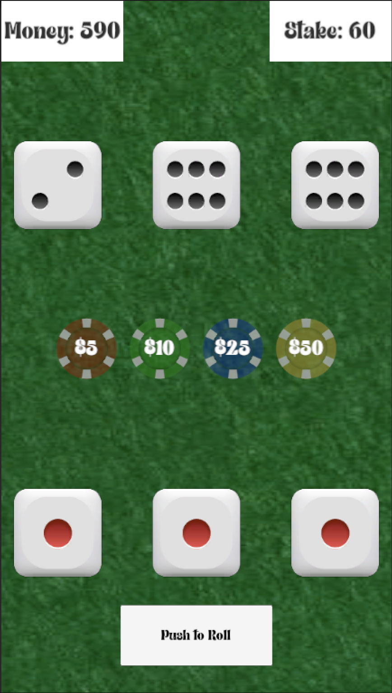

# 🎲 Ceelo Dice - Unity Prototype

This is the first prototype of the Ceelo Dice game, created using **Unity** and **C#**.

> Developed as an early version to explore game mechanics and UI in Unity before moving to React Native.

---

## ✨ Features

- Classic street dice game mechanics implemented
- Dice roll simulation using Unity's physics and scripting
- Simple user interface built with Unity UI components
- Core gameplay loop prototype

---

## 📸 Screenshots

Here's a sneak peek at the prototype gameplay:

  <table>
    <tr>
      <td></td>
      <td></td>
    </tr>
  </table>

---

## 🛠 Tech Stack

- **Game Engine:** Unity (version 2021.3 LTS or later recommended)
- **Language:** C#
- **Build Platforms:** PC / Mac (can be built to mobile with further setup)

---

## 🧠 What I Learned

- Implementing dice roll logic with physics and randomness in Unity
- Setting up Unity UI for game interaction
- Managing game state and player input in C#
- Prototyping gameplay before migrating to other platforms

---

## 🚀 How to Run

1. Clone the repository.
2. Open the project folder in Unity Hub.
3. Open the main scene (e.g., `MainScene.unity`).
4. Press Play in the Unity Editor to try the game.

---
